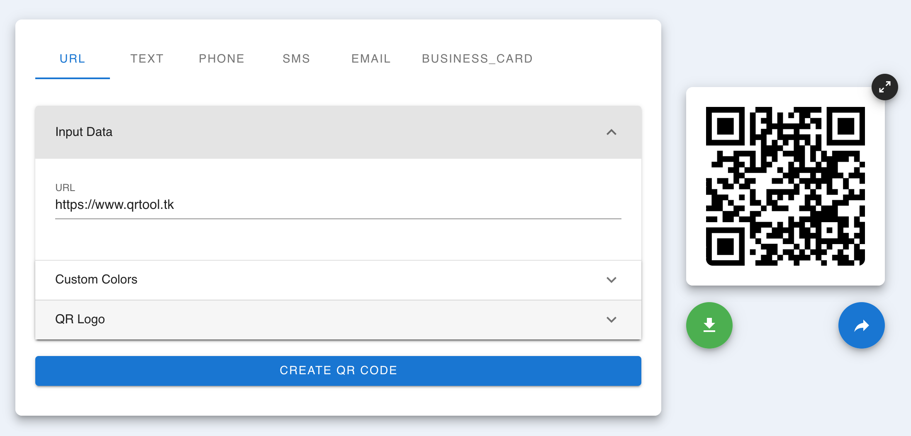

## QR Tool

   

Free Online QR Code Generator to make your own QR Codes. Supports Dynamic Codes, Tracking, Analytics, Free text, vCards and more.

Typing data and get QR Code Image

   

Backup your QR Codes history

   

For more details see [QR Tool](https://www.qrtool.tk).

### Support or Contact

Having trouble with Pages? Check out my [documentation](https://docs.github.com/categories/github-pages-basics/) or [contact support](https://support.github.com/contact) and I’ll help you sort it out.
