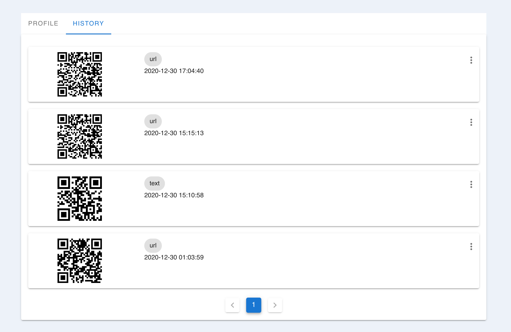

# My Projects
---
---

## QR Tool

   

Free Online QR Code Generator to make your own QR Codes. Supports Dynamic Codes, Tracking, Analytics, Free text, vCards and more.

Typing data and get QR Code Image

   

Backup your QR Codes history

   

For more details see [QR Tool](https://www.qrtool.tk).

## Desktop to Mobile Screen Preview

   

Open Extension to generate QR Code from current browser url

   

Open Mobile Camera to Scan QR Code

   

Mobile will automatically open website like your PC' browser

   

For more details see [Desktop to Mobile Screen Preview](https://chrome.google.com/webstore/detail/desktop-to-mobile-screen/odlbeiijpjkfegcfpopelmjecihkgcce).

# Support or Contact

Having trouble with Pages? Check out my [documentation](https://docs.github.com/categories/github-pages-basics/) or [contact support](https://support.github.com/contact) and I’ll help you sort it out.
